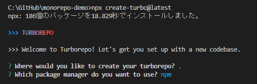
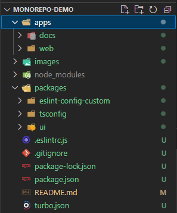

# [Turborepo](https://turbo.build/repo) まとめ
- モノレポ管理ツール
    - 他には[nx](https://nx.dev/getting-started/intro)、[moon](https://moonrepo.dev/moon)などがある

  - JSに閉じられているためbackendも併せて管理したい場合は選びにくいか

- 重要なのは`package.json`の`name`
    - ディレクトリ名と`package.json`の`name`は一致させておくのがベストか

- ルートの`package.json`の以下部分で各workspaceを認識できるように設定されている
```
  "workspaces": [
    "apps/*",
    "packages/*"
  ],
```

- appsからpackagesのファイルを使うためには`package.json`の`dependencies`に追加する
```
  "dependencies": {
    "next": "^13.1.1",
    "react": "^18.2.0",
    "react-dom": "^18.2.0",
    "ui": "*"
  },
```
※tsconfigも同様
```
  "devDependencies": {
    "@babel/core": "^7.0.0",
    "eslint": "7.32.0",
    "eslint-config-custom": "*",
    "tsconfig": "*",
    ...以下略
```

- packages/uiの`package.json`の`main`、`types`でエントリーポイントを指定している
```
{
  "name": "ui",
  "version": "0.0.0",
  "main": "./index.tsx", // 読み込まれた時のエントリーポイントを指定
  "types": "./index.tsx", // 読み込まれた時のエントリーポイントを指定
  "license": "MIT",
  ...以下略
```
index.tsxでButtonがexportされているためappsで使うことができる
```
import * as React from "react";
export * from "./Button";
```

- next.js環境の`tsconfig.json`の設定は`packages/tsconfig`の`nextjs.json`を参照することで統一できる

- `extends`についても作成したjsonファイルを参照することで依存させることができる
```
  "extends": "./base.json",
```

- [ESLintについて](https://turbo.build/repo/docs/getting-started/create-new#understanding-eslint-config-custom)

.eslintrc.js
```
module.exports = {
  // This tells ESLint to load the config from the workspace `eslint-config-custom`
  extends: ["custom"],
};
```
ルートに`.eslintrc.js`を置くことで各プロジェクトに`.eslintrc.js`を持たない場合はルートの`.eslintrc.js`を参照することになる
  - packages/uiはカレントディレクトリに`.eslintrc.js`を持たないため上のディレクトリに探しに行き、ルートにある`.eslintrc.js`を参照する
  - カレントディレクトリに`.eslintrc.js`を作成してルールを追加することで、特定のworkspaceのみルールを適用することもできる


## [公式ドキュメント](https://turbo.build/repo/docs)
### What is a Monorepo?
```
モノレポとは、1つのコードベースに多くの異なるアプリやパッケージを集めたものです。
ポリレポというのは、複数のコードベースを別々に公開し、バージョン管理する方法です。
```

## Quickstart
以下コマンドを実行してモノレポを作成

```
npx create-turbo@latest
```

  

- docs,web,eslint-config-custom,tsconfig,uiそれぞれが独立したworkspace（polyrepoだと5つのリポジトリがあるようなイメージ）
  

- apps
    - ユーザー側が見るもの（デプロイする環境）
- packages
    - 開発用

packagesは相互に依存することはある

## [Summary](https://turbo.build/repo/docs/getting-started/create-new#summary)

ワークスペース間の依存関係マッピング
```
web - depends on ui, tsconfig and eslint-config-custom
docs - depends on ui, tsconfig and eslint-config-custom
ui - depends on tsconfig and eslint-config-custom
tsconfig - no dependencies
eslint-config-custom - no dependencies
```

## [Monorepo Handbook](https://turbo.build/repo/docs/handbook)

### How do monorepos work?

### [Package Install](https://turbo.build/repo/docs/handbook/package-installation)
- packageをインストールする場合は以下コマンドを利用することでそれぞれのworkspaceにインストールすることができる。

npmの場合
```
npm install <package> --workspace=<workspace>
```

yarnの場合
```
yarn workspace <workspace> add <package>
```